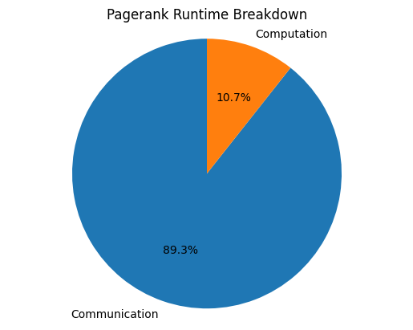
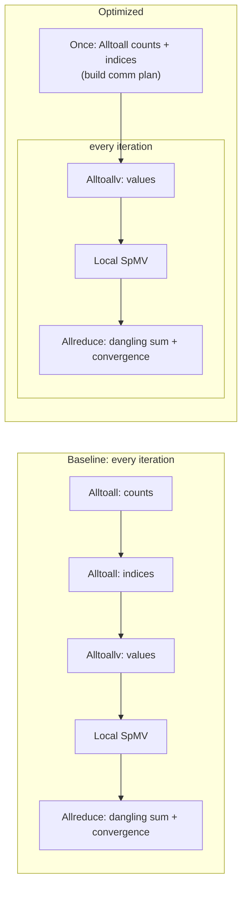
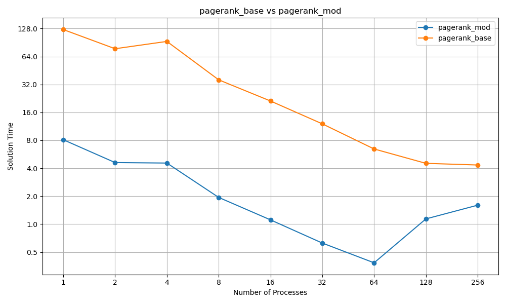
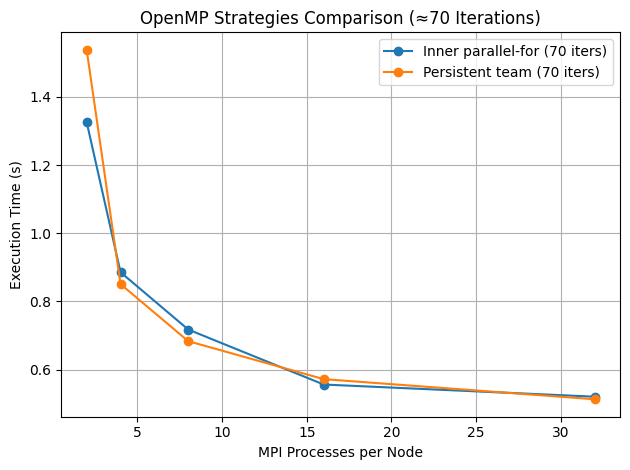
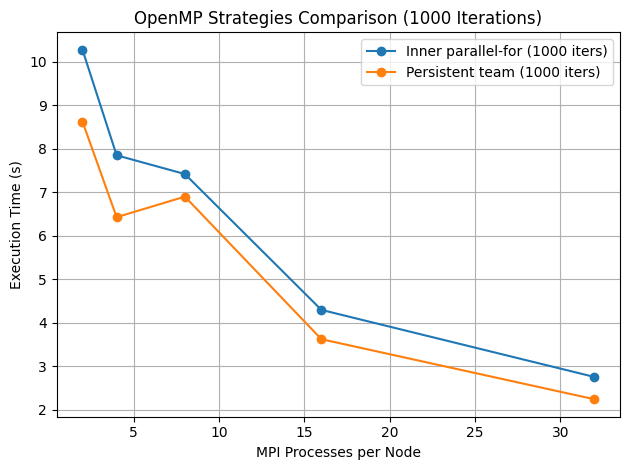
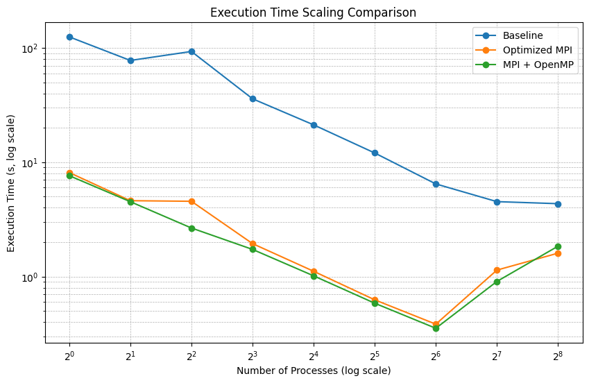

# Optimizing PageRank with MPI and OpenMP

Distributed PageRank in C++ over a **916K-node, 5.1M-edge web graph**, scaled to 256 processes on an HPC cluster. Profiling showed that **89% of the runtime was communication**. We restructured the distributed sparse matrix–vector multiply (SpMV) to move the costly setup exchanges out of the iteration loop, then added an MPI + OpenMP hybrid on top.

**Results:**
- **Up to 20× faster** than the baseline MPI implementation at the same process count. It is still **4× faster at 256 processes**.
- Wall-clock time falls from about **2 minutes** (baseline, 1 process) to **under 0.4 s** (optimized, 64 processes).
- A persistent OpenMP thread team gives a further **15–20%** on long runs.

By Alekh Pandey and Brodie Witkowski, Parallel Processing course, University of New Mexico, Fall 2025.

---

## Problem

PageRank is the stationary distribution of a random surfer on a directed graph. It is computed by power iteration:

$$PR^{(k+1)} = d \cdot M \, PR^{(k)} + \frac{(1-d) + d \cdot \text{dangling\_sum}(PR^{(k)})}{N}$$

where $M$ is the column-normalized adjacency matrix, $d = 0.85$ is the damping factor, and the dangling term redistributes rank from pages with no outgoing links. Each iteration is one **SpMV**, and this graph converges in about 70 iterations at a tolerance of 1e-4.

**Dataset:** [`SNAP/web-Google`](https://sparse.tamu.edu/SNAP/web-Google), the 2002 Google web graph (916,428 nodes, 5,105,039 edges). All ranks read it **in parallel** from a PETSc binary file into a row-distributed **CSR** matrix.

## Where the time goes

<p align="center"></p>

In the baseline, every iteration of the distributed SpMV performed three all-to-all exchanges:

1. `MPI_Alltoall` to exchange **counts** (how many vector entries each rank needs from each other rank)
2. `MPI_Alltoall` to exchange **indices** (which entries)
3. `MPI_Alltoallv` to exchange the **values** themselves

The sparsity pattern never changes between iterations, so steps 1 and 2 give the same answer every time.

## Optimization 1: Deconstructed SpMV (communication)

We moved the count and index exchanges out of the loop and computed the communication plan **once**. Each iteration now performs only the value exchange plus two scalar `MPI_Allreduce`s, one for the dangling-node sum and one for the convergence check.



<p align="center"></p>

The optimized version is up to **20× faster** at low process counts and still **4× faster at 256**. It scales well up to 64 processes. Beyond that, the per-process work becomes so small that the remaining collective communication dominates, and runtime starts to rise again.

## Optimization 2: MPI + OpenMP hybrid (computation)

We compared two OpenMP strategies for the local SpMV and vector updates:

| Strategy | Approach |
|---|---|
| **Inner parallel-for** | `#pragma omp parallel for` inside each iteration, which forks and joins a thread team every time |
| **Persistent team** | A single `#pragma omp parallel` region outside the iteration loop; the threads are reused across iterations and synchronized with barriers, with `MPI_THREAD_FUNNELED` |

We then swept hybrid layouts at a fixed 256 execution units, from 2 processes × 32 threads up to 32 processes × 2 threads per node.

| ~70 iterations (normal convergence) | 1000 iterations (forced) |
|---|---|
|  |  |

**Findings:**

- The persistent team wins: **1–5% faster** at about 70 iterations, and **15–20% faster** at 1000 iterations once the fork/join overhead adds up.
- **More MPI processes beat more threads.** Trading processes for threads raises the communication volume per process, and since PageRank is communication-bound, that outweighs the faster computation.
- The best configuration was **32 processes per node × 2 threads, with a persistent team**.

## Final comparison

<p align="center"></p>

Restructuring the communication gives most of the speedup. The hybrid version improves on it a little further, which fits with PageRank on this graph converging in few iterations with little computation per iteration.

## Repository Structure

```
.
├── CMakeLists.txt
├── c/
│   ├── libs/
│   │   ├── reader.cpp            # Parallel PETSc-binary reader → distributed CSR
│   │   ├── mat_op.cpp            # Distributed SpMV, baseline + optimized PageRank
│   │   ├── openmp_mat_op.cpp     # Hybrid kernels: parallel-for + persistent-team
│   │   └── my_time.cpp           # Timer
│   └── src/
│       ├── page_rank.cpp             # → page_rank                  (baseline MPI)
│       ├── page_rank_mod.cpp         # → mod_page_rank              (optimized MPI)
│       ├── openmp_page_rank.cpp      # → openmp_page_rank           (hybrid, parallel-for)
│       ├── openmp_page_rank_mod.cpp  # → enhanced_openmp_page_rank  (hybrid, persistent team)
│       └── spmv_example.cpp
├── python/
│   ├── convert_mtx_fast.py       # Matrix Market → PETSc binary (.pm), transposed for PageRank
│   └── grapher.py                # Plots scaling results
├── data/small.{mtx,pm}           # Small test graph
├── pagerank1.sh, thread_page_rank.sh   # Sample Slurm job scripts
└── docs/images/                  # Result figures
```

## Build & Run

**Requirements:** a C++11 compiler, CMake ≥ 3.12, an MPI implementation (OpenMPI tested), and OpenMP.

```bash
mkdir -p build && cd build
cmake .. && make -j
```

**Prepare a graph.** Download `web-Google.mtx` from [SuiteSparse](https://sparse.tamu.edu/SNAP/web-Google) into `data/`, then convert it to PETSc binary. Edit the paths at the bottom of the script first.

```bash
pip install -r requirements.txt
cd python && python convert_mtx_fast.py
```

**Run.** Executables look up the file name under `data/`. Usage: `<exe> <file.pm> [tolerance=1e-4] [max_iters=100]`.

```bash
mpirun -n 4 ./build/page_rank small.pm                          # baseline
mpirun -n 4 ./build/mod_page_rank small.pm                      # optimized MPI
OMP_NUM_THREADS=2 mpirun -n 4 ./build/enhanced_openmp_page_rank small.pm 1e-4 100   # hybrid
```

On a Slurm cluster, see `thread_page_rank.sh` for the hybrid job setup (`--ntasks-per-node=32 --cpus-per-task=2`, `OMP_PROC_BIND=close`). Experiments were run on UNM CARC's Easley cluster.

## Future Work

- Store the matrix in **CSC**, which fits the column-oriented (source → destination) structure of PageRank
- **One-sided MPI** (RMA) communication to overlap or remove the per-iteration `Alltoallv`
- Larger graphs, where the computation share is bigger and the OpenMP gains should be larger
